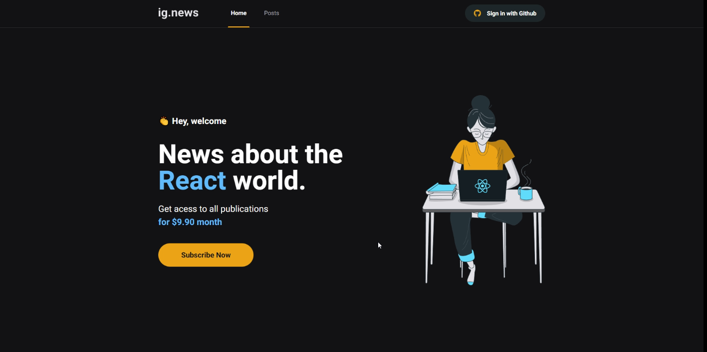
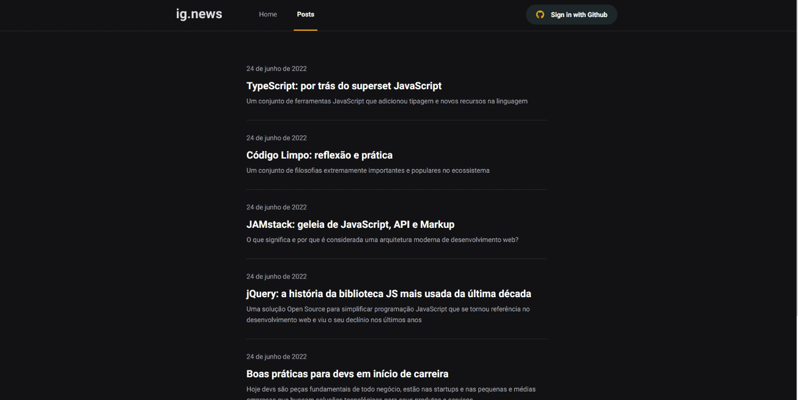

# ignews

## Table of contents

- [ignews](#ignews)
  - [Table of contents](#table-of-contents)
  - [Overview](#overview)
    - [Screenshot](#screenshot)
    - [Home](#home)
    - [Posts](#posts)
    - [Links](#links)
  - [My process](#my-process)
    - [Built with](#built-with)
    - [Continued development](#continued-development)

## Overview

### Screenshot

### Home

### Posts

### Links

- [Link website](https://ignews-inanbruneli.vercel.app/)

## My process

### Built with

- ReactJS
- NextJS
  - Context
  - Typescript
  - SCSS

- API
  - NextAuth
  - Prismic
  - Stripe
  - FaunaDB

### Continued development

Training external api consumption via ReactJS.
Feel free to put your feedback 🚀🚀

